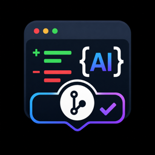

<p align="center">
  
</p>

<h1 align="center">CommitCraft AI: Smart Git Commits</h1>

<p align="center">
  AI-powered commit messages from your local changes — reviewed, editable, never autonomous.
</p>

<p align="center">
  <a href="https://marketplace.visualstudio.com/items?itemName=CommitCraftAISmartGitCommits.commitcraft-ai-smart-git-commits">
    
  </a>
  <a href="https://marketplace.visualstudio.com/items?itemName=CommitCraftAISmartGitCommits.commitcraft-ai-smart-git-commits">
    
  </a>
  
</p>

---

CommitCraft AI opens a focused commit assistant inside VS Code, shows exactly which files will be sent to the AI, generates a structured and editable commit message via [OpenRouter](https://openrouter.ai), then lets you **Commit**, **Push**, or **Commit + Push** — always with your confirmation.

It is intentionally not autonomous. Nothing is committed or pushed without an explicit click.

---

## Screenshots

<!-- Screenshot 1: File preview + Generate button (initial state) -->
<!-- Screenshot 2: Generated message with summary, description, risk badge, and stat strip -->
<!-- Screenshot 3: Post-commit state with Push / Undo actions and activity timeline -->

> **Want to contribute screenshots?** Capture the CommitCraft panel at each stage and open a PR, or share a link and we'll add them here.

---

## Requirements

- VS Code **1.96** or later
- A free or paid [OpenRouter](https://openrouter.ai) account — API key stored in VS Code `SecretStorage`, never in settings files

---

## Installation

Install from the [VS Code Marketplace](https://marketplace.visualstudio.com/items?itemName=CommitCraftAISmartGitCommits.commitcraft-ai-smart-git-commits), or search **CommitCraft AI** inside VS Code (`Ctrl+Shift+P` → _Extensions: Install Extensions_).

---

## Quick Start

1. Open a Git repository in VS Code and make some changes.
2. Run **CommitCraft: Open Commit Assistant** from the Command Palette (`Ctrl+Shift+P` / `Cmd+Shift+P`), click the ✦ button in the Source Control title bar, or click **CommitCraft** in the status bar.
3. If prompted, paste your OpenRouter API key.
4. Review the file list — deselect anything you don't want included.
5. Click **Generate Message →**.
6. Edit the summary or description if needed.
7. Click **Commit**, **↑ Push**, or **Commit + Push** and confirm.

---

## Features

| | |
|---|---|
| **Single-command workflow** | One entry point: Command Palette, Source Control button, or status bar. |
| **File selection** | Review and choose which safe files are sent to OpenRouter before anything is generated. |
| **Staged-first** | Uses staged changes when they exist; falls back to safe unstaged and untracked files otherwise. |
| **Change stats strip** | Files changed, lines added, and lines removed — visible at a glance. |
| **Excluded file transparency** | Lists excluded files with the reason: secret-like, lockfile, binary/generated asset, or too large. |
| **Editable message** | Generates a structured summary + multi-line description you can revise before committing. |
| **Commit type + risk badge** | Shows the detected conventional commit type and a risk level (low / medium / high). |
| **Activity timeline** | Tracks every commit, push, and undo performed during the session. |
| **Undo commit** | Soft-resets the last local commit and keeps changes staged for revision. |
| **Pending push banner** | Shows when unpushed local commits exist and offers a direct push action. |
| **Multi-root workspace** | Prefers the workspace folder that contains the active editor. |
| **Safe by default** | `.env`, secret-like paths, key/certificate files, lockfiles, binary assets, and oversized files are excluded from the prompt. |

---

## Commands

| Command | Purpose |
|---|---|
| `CommitCraft: Open Commit Assistant` | Primary workflow — review files, generate a message, commit, and push. |
| `CommitCraft: Set OpenRouter API Token` | Save or replace your OpenRouter API key in VS Code `SecretStorage`. |
| `CommitCraft: Clear OpenRouter API Token` | Remove the saved API key. |

---

## Settings

| Setting | Default | Description |
|---|---|---|
| `commitCraft.openRouterModel` | `openrouter/auto` | Primary model for message generation. |
| `commitCraft.fallbackModel` | `openrouter/free` | Fallback model used when the primary fails. |
| `commitCraft.maxDiffCharacters` | `60000` | Max diff characters sent to OpenRouter. Larger diffs are truncated. |
| `commitCraft.includeUntrackedFiles` | `true` | Include safe untracked text files when nothing is staged. |

```json
{
  "commitCraft.openRouterModel": "openrouter/auto",
  "commitCraft.fallbackModel": "openrouter/free",
  "commitCraft.maxDiffCharacters": 60000,
  "commitCraft.includeUntrackedFiles": true
}
```

---

## Commit Message Format

CommitCraft requests structured JSON from OpenRouter and renders it as an editable commit message following the [Conventional Commits](https://www.conventionalcommits.org) spec:

```
<type>(<scope>): <short summary>

<description>
```

Supported types: `feat` `fix` `docs` `refactor` `test` `chore` `build` `ci` `style` `perf` `revert`

---

## Safety & Privacy

- API keys are stored **only** in VS Code `SecretStorage` and never written to settings files or sent in prompts.
- API keys are redacted from surfaced error messages.
- `.env`, secret-like paths, certificate/key files, lockfiles, binary/generated assets, and oversized files are excluded from prompt context automatically.
- Excluded files are visible in the assistant before generation — nothing is hidden.
- Staged changes are preferred. When staged changes exist, unstaged and untracked files are not included.
- Every commit and push action requires explicit confirmation.
- Push is disabled when the repository has no remote or is in a detached HEAD state.

---

## Architecture

```
src/
  extension.ts
  commands/
    generateCommitMessage.ts   ← main workflow
    setOpenRouterToken.ts
    clearOpenRouterToken.ts
    workspaceResolver.ts
  config/
    settings.ts
    vscodeSettings.ts
  git/
    changeStats.ts
    diffCollector.ts           ← diff collection, safety filtering
    gitService.ts              ← commit, push, undo, status
  openrouter/
    commitPrompt.ts
    openRouterClient.ts        ← API calls, timeout, fallback
    responseParser.ts          ← JSON validation, plain-text recovery
  ui/
    commitAssistantHtml.ts     ← webview HTML renderer
    commitReviewPanel.ts       ← panel lifecycle and message routing
    notifications.ts
```

---

## Development

```bash
npm install
npm run compile      # type-check + build → dist/
npm test             # Vitest unit tests (46 tests)
npm run lint         # ESLint
npm run format       # Prettier
npm run vscode:test  # VS Code extension-host integration tests
npm run package      # produces .vsix
```

---

## Non-Goals

- Autonomous commits or pushes without user confirmation.
- Rewriting or modifying user code.
- Replacing pull request descriptions.
- Managing GitHub/GitLab-specific workflows.

---

## License

MIT
